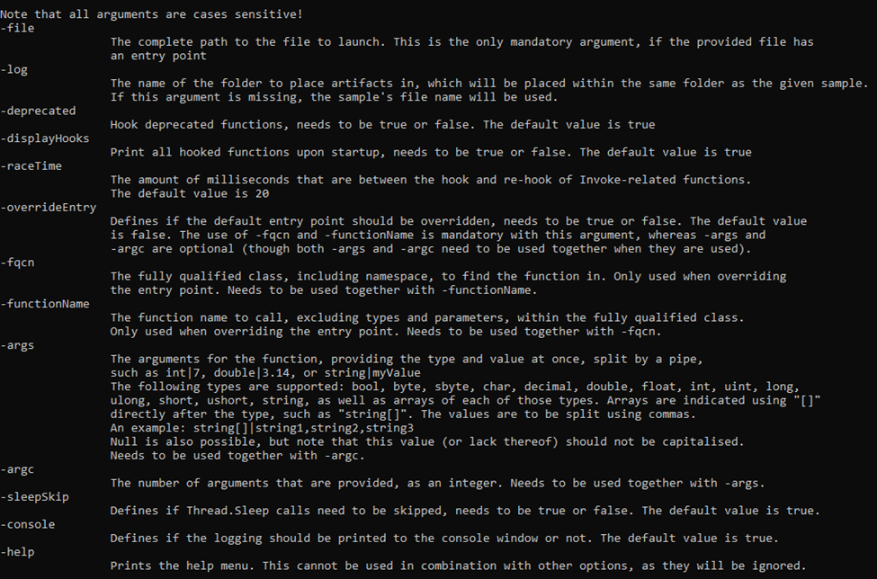
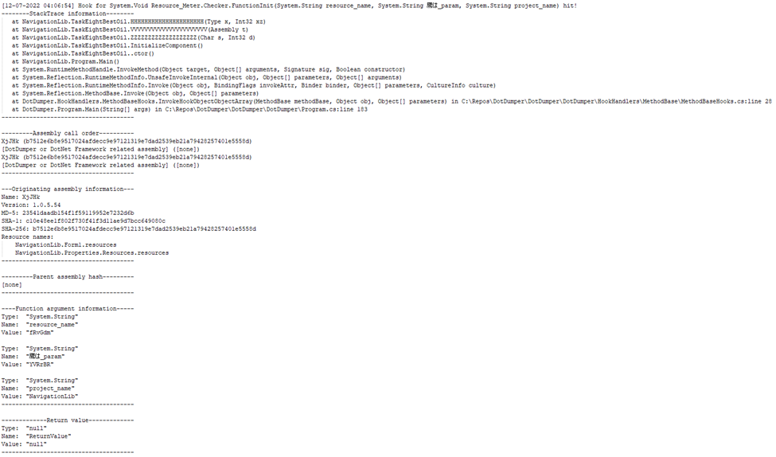
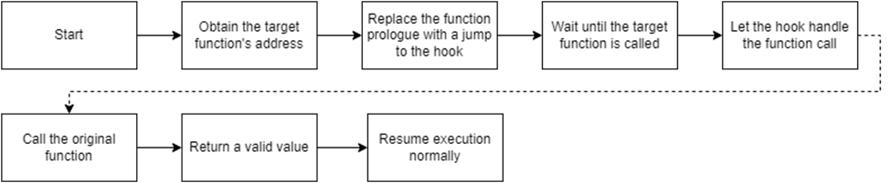
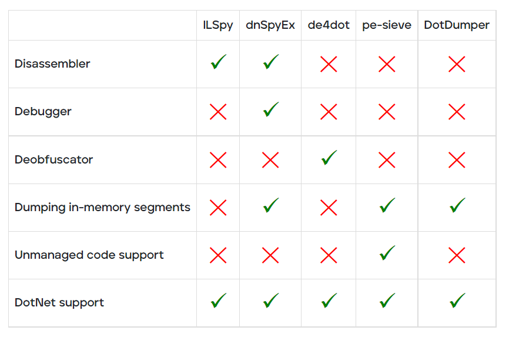

# DotDumper
An automatic unpacker and logger for DotNet Framework targeting files! This tool has been unveiled at [Black Hat USA 2022](https://www.blackhat.com/us-22/arsenal/schedule/index.html#dotdumper-automatically-unpacking-dotnet-based-malware-27846).

The automatic detection and classification of any given file in a reliable manner is often considered the holy grail of malware analysis. The trials and tribulations to get there are plenty, which is why the creation of such a system is held in high regard. When it comes to DotNet targeting binaries, our new open-source tool DotDumper aims to assist in several of the crucial steps along the way: logging (in-memory) activity, dumping interesting memory segments, and extracting characteristics from the given sample.

## Table of contents
* <a href="#why_dotdumper">Why DotDumper?</a>
* <a href="#features">Features</a>
    * <a href="#cli">Using the command-line interface</a>
    * <a href="#logging_and_dumping">Logging and dumping</a>
    * <a href="#reflection">Reflection</a>
    * <a href="#managed_hooks">Managed hooks</a>
    * <a href="#extendible">Easily extendible</a>
* <a href="#differences">Differences with known tooling</a>
* <a href="#future_work">Future work</a>

## <a name="why_dotdumper">Why DotDumper?</a>
In brief, manual unpacking is a tedious process which consumes a disproportional amount of time for analysts. Obfuscated binaries further increase the time an analyst must spend to unpack a given file. When scaling this, organizations need numerous analysts who dissect malware daily, likely in combination with a scalable sandbox. The lost valuable time could be used to dig into interesting campaigns or samples to uncover new threats, rather than the mundane generic malware that is widely spread. Afterall, analysts look for the few needles in the haystack.

So, what difference does DotDumper make? Running a DotNet based malware sample via DotDumper provides log files of crucial, contextualizing, and common function calls in three formats (human readable plaintext, JSON, and XML), as well as copies from useful in-memory segments. As such, an analyst can skim through the function call log. Additionally, the dumped files can be scanned to classify them, providing additional insight into the malware sample and the data it contains. This cuts down on time vital to the triage and incident response processes, and frees up SOC analyst and researcher time for more sophisticated analysis needs.

## <a name="features">Features</a>
To log and dump the contextualizing function calls and their results, DotDumper uses a mixture of reflection and managed hooks, all written in pure C#. Below, key features will be highlighted and elaborated upon, in combination with excerpts of DotDumper’s results of a packed AgentTesla stealer sample, the hashes of which are below.

|Hash type | Hash value |
| --- | ----------- |
| SHA-256 | b7512e6b8e9517024afdecc9e97121319e7dad2539eb21a79428257401e5558d |
| SHA-1 | c10e48ee1f802f730f41f3d11ae9d7bcc649080c |
| MD-5 | 23541daadb154f1f59119952e7232d6b |

### <a name="cli">Using the command-line interface</a>
DotDumper is accessible through a command-line interface, with a variety of arguments. The image below shows the help menu. Note that not all arguments will be discussed, but rather the most used ones.

The minimal requirement to run a given sample, is to provide the “-file” argument, along with a file name or file path. If a full path is given, it is used. If a file name is given, the current working directory is checked, as well as the folder of DotDumper’s executable location.

Unless a directory name is provided, the “-log” folder name is set equal to the file name of the sample without the extension (if any). The folder is located in the same folder as DotDumper resides in, which is where the logs and dumped files will be saved in.

In the case of a library, or an alternative entry point into a binary, one must override the entry point using “-overrideEntry true”. Additionally, one has to provide the fully qualified class, which includes the name space using “-fqcn My.NameSpace.MyClass”. This tells DotDumper which class to select, which is where the provided function name (using “-functionName MyFunction”) is retrieved.

If the selected function requires arguments, one has to provide the number of arguments using “-argc” and the number of required arguments. The argument types and values are to be provided as “string|myValue int|9”. Note that when spaces are used in the values, the argument on the command-line interface needs to be encapsulated between quotes to ensure it is passed as a single argument.

Other less frequently used options such as “-raceTime” or “-deprecated” are safe in their default settings but might require tweaking in the future due to changes in the DotNet Framework. They are currently exposed in the command-line interface to easily allow changes, if need be, even if one is using an older version of DotDumper when the time comes.

### <a name="logging_and_dumping">Logging and dumping</a>
Logging and dumping are the two core features of DotDumper. To minimize the amount of time the analysis takes, the logging should provide context to the analyst. This is done by providing the analyst with the following information for each logged function call:

* A stack trace based on the function’s caller
*	Information regarding the assembly object where the call originated from, such as the name, version, and cryptographic hashes
*	The parent assembly, from which the call originates if it is not the original sample
*	The type, name, and value of the function’s arguments
*	The type, name, and value of function’s return value, if any
*	A list of files which are dumped to disk which correspond with the given function call

Note that for each dumped file, the file name is equal to the file’s SHA-256 hash.

To clarify the above, an excerpt of a log is given below. The excerpt shows the details for the aforementioned AgentTesla sample, where it loads the second stage using DotNet’s Assembly.Load function.

![The log for an intercepted Assembly.Load(byte[] rawAssembly) function call](images/assembly_load.png)

First, the local system time is given, together with the original function’s return type, name, and argument(s). Second, the stack trace is given, where it shows that the sample’s main function leads to a constructor, initialises the components, and calls two custom functions. The Assembly.Load function was called from within “NavigationLib.TaskEightBestOil.GGGGGGGGGGGGGGGGGGGG(String str)”. This provides context for the analyst to find the code around this call if it is of interest.

Then, information regarding the assembly call order is given. The more stages are loaded, the more complex it becomes to see via which stages the call came to be. One normally expects one stage to load the next, but in some cases later stages utilize previous stages in a non-linear order. Additionally, information regarding the originating assembly is given to further enrich the data for the analyst.

Next, the parent hash is given. The parent of a stage is the previous stage, which in this example is not yet present. The newly loaded stage will have this stage as its parent. This allows the analyst to correlate events more easily.

Finally, the function’s return type and value are stored, along with the type, name, and value of each argument that is passed to the hooked function. If any variable is larger than 100 bytes in size, it is stored on the disk instead. A reference is then inserted in the log to reference the file, rather than showing the value. The threshold has been set to avoid hiccups in the printing of the log, as some arrays are thousands of indices in size.

### <a name="reflection">Reflection</a>
Per Microsoft’s documentation, reflection is best [summarized]([url](https://docs.microsoft.com/en-us/dotnet/framework/reflection-and-codedom/reflection)) as “[…] provides objects that encapsulate assemblies, modules, and types”. In short, this allows the dynamic creation and invocation of DotNet classes and functions from the malware sample. DotDumper contains a reflective loader which allows an analyst to load and analyze both executables and libraries, as long as they are DotNet Framework based.

To utilize the loader, one has to opt to overwrite the entry point in the command-line interface, specify the class (including the namespace it resides in) and function name within a given file. Optionally, one can provide arguments to the specified function, for all native types and arrays thereof. Examples of native types are int, string, char, and arrays such as int[], string[], and char[]. All the arguments are to be provided via the command-line interface, where both the type and the value are to be specified.

Not overriding the entry point results in the default entry point being used. By default, an empty string array is passed towards the sample’s main function, as if the sample is executed without arguments.
Additionally, reflection is often used by loaders to invoke a given function in a given class in the next stage. Sometimes, arguments are passed along as well, which are used later to decrypt a resource. In the aforementioned AgentTesla sample, this exact scenario plays out. DotDumper’s invoke related hooks log these occurrences, as can be seen below.

The function name in the first line is not an internal function of the DotNet Framework, but rather a call to a specific function in the second stage. The types and names of the three arguments are listed in the function signature. Their values can be found in the function argument information section. This would allow an analyst to load the second stage in a custom loader with the given values for the arguments, or even do this using DotDumper by loading the previously dumped stage and providing the arguments. 

### <a name="managed_hooks">Managed hooks</a>
Before going into managed hooks, one needs to understand how hooks work. There are two main variables to consider here: the target function and a controlled function which is referred to as the hook. Simply put, the memory at the target function (i.e. Assembly.Load) is altered to instead to jump to the hook. As such, the program’s execution flow is diverted. The hook can then perform arbitrary actions, optionally call the original function, after which it returns the execution to the caller together with a return value if need be. The diagram below illustrates this process.

Knowing what hooks are is essential to understand what managed hooks are. Managed code is executed in a virtual and managed environment, such as the DotNet runtime or Java’s virtual machine.  Obtaining the memory address where the managed function resides differs from an unmanaged language such as C. Once the correct memory addresses for both functions have been obtained, the hook can be set by directly accessing memory using unsafe C#, along with DotNet’s interoperability service to call native Windows API functionality.

### <a name="extendible">Easily extendible</a>
Since DotDumper is written in pure C# without any external dependencies, one can easily extend the framework using Visual Studio. The code is documented in this blog, on GitHub, and in classes, in functions, and in-line in the source code. This, in combination with the clear naming scheme, allows anyone to modify the tool as they see fit, minimizing the time and effort that one needs to spend to understand the tool. Instead, it allows developers and analysts alike to focus their efforts on the tool’s improvement.

## <a name="differences">Differences with known tooling</a>
With the goal and features of DotDumper clear, it might seem as if there’s overlap with known publicly available tools such as [ILSpy](https://github.com/icsharpcode/ILSpy), [dnSpyEx](https://github.com/dnSpyEx/dnSpy), [de4dot](https://github.com/de4dot/de4dot), or [pe-sieve](https://github.com/hasherezade/pe-sieve). Note that there is no intention to proclaim one tool is better than another, but rather how the tools differ.

DotDumper’s goal is to log and dump crucial, contextualizing, and common function calls from DotNet targeting samples. ILSpy is a DotNet disassembler and decompiler, but does not allow the execution of the file. dnSpyEx (and its predecessor dnSpy) utilise ILSpy as the disassembler and decompiler component, while adding a debugger. This allows one to manually inspect and manipulate memory. de4dot is solely used to deobfuscate DotNet binaries, improving the code’s readability for human eyes. The last tool in this comparison, pe-sieve, is meant to detect and dump malware from running processes, disregarding the used programming language. The table below provides a graphical overview of the above-mentioned tools.

## <a name="future_work">Future work</a>
DotDumper is under constant review and development, all of which is focused on two main areas of interest: bug fixing and the addition of new features. During the development, the code was tested, but due to injection of hooks into the DotNet Framework’s functions which can be subject to change, it’s very well possible that there are bugs in the code. Anyone who encounters a bug is urged to open an issue on the GitHub repository, which will then be looked at. The suggestion of new features is also possible via the GitHub repository. For those with a GitHub account, or for those who rather not publicly interact, feel free to send me a private message on my [Twitter](https://twitter.com/Libranalysis).

Needless to say, if you've used DotDumper during an analysis, or used it in a creative way, feel free to reach out in public or in private! There’s nothing like hearing about the usage of a home-made tool! 

There is more in store for DotDumper, and an update will be sent out to the community once it is available!

## License
All code, unless stated otherwise, is licensed as follows:

<pre>
Copyright © 2022 Musarubra US LLC,
Licensed under the Apache License, Version 2.0 (the "License");
you may not use this file except in compliance with the License.
You may obtain a copy of the License at

  http://www.apache.org/licenses/LICENSE-2.0

Unless required by applicable law or agreed to in writing, software
distributed under the License is distributed on an "AS IS" BASIS,
WITHOUT WARRANTIES OR CONDITIONS OF ANY KIND, either express or implied.
See the License for the specific language governing permissions and
limitations under the License.
</pre>

The Hook.cs class is based on Michael Pekar's DumbHook, which is licensed as follows:

<pre>
MIT License

Copyright (c) 2022 Michael Pekar

Permission is hereby granted, free of charge, to any person obtaining a copy
of this software and associated documentation files (the "Software"), to deal
in the Software without restriction, including without limitation the rights
to use, copy, modify, merge, publish, distribute, sublicense, and/or sell
copies of the Software, and to permit persons to whom the Software is
furnished to do so, subject to the following conditions:

The above copyright notice and this permission notice shall be included in all
copies or substantial portions of the Software.

THE SOFTWARE IS PROVIDED "AS IS", WITHOUT WARRANTY OF ANY KIND, EXPRESS OR
IMPLIED, INCLUDING BUT NOT LIMITED TO THE WARRANTIES OF MERCHANTABILITY,
FITNESS FOR A PARTICULAR PURPOSE AND NONINFRINGEMENT. IN NO EVENT SHALL THE
AUTHORS OR COPYRIGHT HOLDERS BE LIABLE FOR ANY CLAIM, DAMAGES OR OTHER
LIABILITY, WHETHER IN AN ACTION OF CONTRACT, TORT OR OTHERWISE, ARISING FROM,
OUT OF OR IN CONNECTION WITH THE SOFTWARE OR THE USE OR OTHER DEALINGS IN THE
SOFTWARE.

------------------------------------------------------------------------
Originally released on unknowncheats.me by me in 2017:
https:www.unknowncheats.me/forum/c-/213492-hook-managed-function.html#post1700496
</pre>

The license file also references this.
